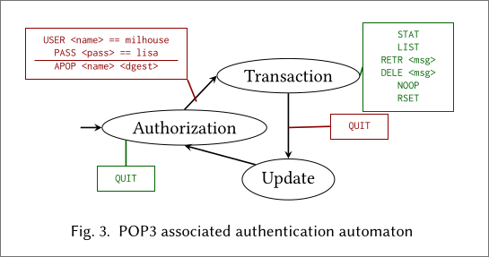

# Steps to do before performing a Tulip analysis

- [Steps to do before performing a Tulip analysis](#steps-to-do-before-performing-a-tulip-analysis)
  - [1) Build the program automaton](#1-build-the-program-automaton)
    - [1.1) Concept](#11-concept)
    - [2.2) Construction of the representation of the automaton](#22-construction-of-the-representation-of-the-automaton)
  - [2) Compile the program itself](#2-compile-the-program-itself)

## 1) Build the program automaton

### 1.1) Concept

First of all, it is mandatory to read the specification of the target (Eg. RFC) to determine which commands are used to perform authentication, and which states are privileged.

For example, for the RFC 1939 (POP3), the related automaton is :


In this automaton, there is an entry state : Authorization, and a privileged state : Transaction.

The attacker would like to access to the privileged state without any knowledge about legal credentials.

To do that, he will hijack the transition from the Authorization state to the Transaction state.

### 2.2) Construction of the representation of the automaton

With the previous automaton, let's construct its representation for Tulip, with a legitimate user `milhouse` who has `lisa` as password !

Here is the CSL representation of the automaton :
```
levels:
  level authorization:
    USER (arg == "milhouse" => level = authorization_login_milhouse | _ => level = authorization),
    QUIT (_);

  level authorization_login_milhouse:
    PASS (arg == "lisa" => level = transaction | _ => level = authorization),
    USER (arg == "milhouse" => level = authorization_login_milhouse | _ => level = authorization),
    QUIT (_);

  level transaction:
    STAT,
    LIST (_),
    RETR (_),
    DELE (_),
    NOOP (_),
    RSET,
    QUIT (_ => level = update);

  level update:
    QUIT (_ => level = authorization);
```

More details about the CSL language can be found in the `cslprocess` documentation.

## 2) Compile the program itself

As explained in [readme](../README.md), Tulip is built around [AFL++](https://github.com/AFLplusplus/AFLplusplus) to build test cases.

So, the analyst have to build his target with `afl-cc` in several ways :
- With the LTO optimization (`afl-clang-lto`)
  - At the end, we will have `target.lto.afl`
- With CmpLog (`afl-clang-lto` + Environment variable `AFL_LLVM_CMPLOG=1`)
  - At the end, we will have `target.lto.cmplog`
- With LAF-Intel (`afl-clang-fast` + Environment variable `AFL_LLVM_LAF_ALL=1`)
  - At the end, we will have `target.laf-intel.afl`

In addition, he have to build his target "normally" with a standard compiler, like `gcc` or `clang`. This binary will be renamed to `target.ori`.